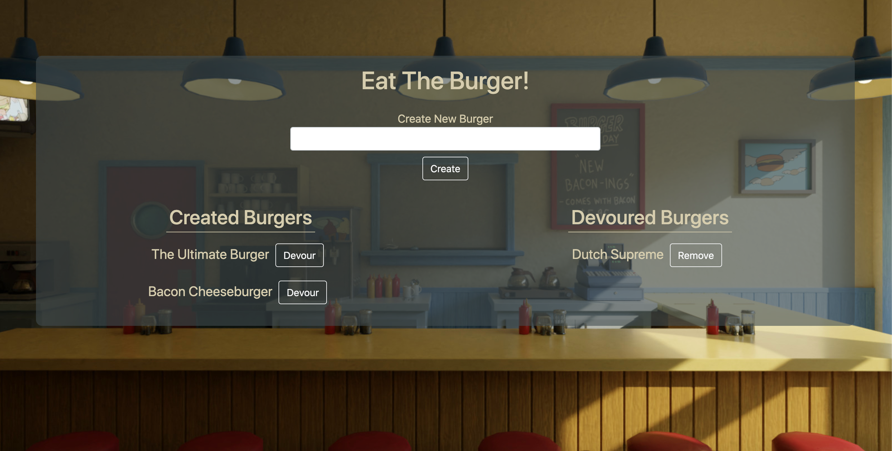
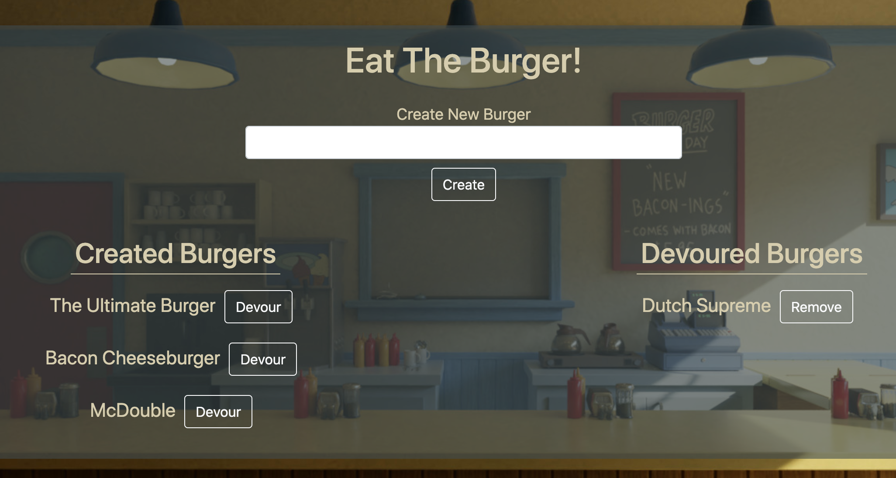

# Eat The Burger



## Description 
This application is built on an express server and uses a mySQL to persist data.  In this application, the user can create new burgers, eat the burgers, and then remove eaten burgers.  On the front end, html is rendered dynamically using express-handlebars and is fully responsive with bootstrap.           

#### Built With
* Express.js
* Node.js
* mySQL
* Express-HandleBars (html templating)
* Boostrap

## Table of Contents
  
* [Installation](#installation)
* [Usage](#usage)
* [Questions](#questions)
  
  
## Installation
### View the Project Live
https://hangman-react-app.herokuapp.com/

### Run the Project Locally
** This project requires node.js and mySQL to run locally so make sure these are installed on your device.  **

* Step 1: Navigate to the directory you want to store the project. Clone this your repository to your local computer using the command below. 
```bash
git clone https://github.com/MarkMulligan97/readmeGenerator.git
```

* Step 2: Use the command line to navigate to the directory that you cloned the project.
Example:
```bash
cd directory/projectdirectory
```

* Step 3: Install the npm package dependencies from the package.json file.
```bash
npm install
```

* Step 4: Make sure an instance of mySQL is running on your local device. 

https://www.mysqltutorial.org/mysql-adminsitration/start-mysql

* Step 5: Use the commands in schema.sql in the db folder to create the database for this project.  You can populate the database usings the seeds.sql file. I personally like to use mySQLWorkbench to interact with the database to run these commands.    
https://dev.mysql.com/doc/refman/8.0/en/creating-database.html

* Step 6: While in the project directory, run the program using node using the command below. Open you browser and navigate to localhost:3000 to view the application.
```bash
node server.js
```  

## Usage 

1.  To create a new burger, type you the burger name into the input field and hit the create button.  
2.  To eat a burger, click the devour button next to the created burgers.
3.  To remove a burger, click the remove button next to the devoured burgers.    



## Questions
[My Github](https://github.com/MarkMulligan97) || mark.mulligan.jr1@gmail.com

#### How to Contact Me
Feel free to reach out to me if you have any questions about this project.  You can email me using the email listed above or can go to my github page to view my other projects and portfolio.

© Mark Mulligan 2021 All Rights Reserved.